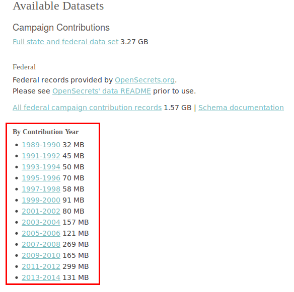

# README: Big Data Statistics for R and Python: Group Examination of Part I

*Spring Term 2019*

*Prof. Dr. Ulrich Matter*

*(University of St. Gallen)*

## General remarks

In this group examination task, your team will be developing a simple data pipeline that handles a moderately sized real-world data set. All instructions, hints, tips, etc. to complete the group examination are in this document. Apart from this document, you are on your own. The group examination is structured into two parts:

 - Part I (max. 15 points): You will be asked to implement four different tasks (four components of the data pipeline) that (partly) build on each other. For each task you present a solution (the implementation in R) and explain in a brief (!) exposition why you have implemented the solution the way you did and/or respond to some specific conceptual questions. As this is an exercise with real-world data and real-world problems, there is typically not only one correct solution. In some cases, there might be a trade-off between different strategies and you will have to take a decision regarding which strategy should enter your solution. In the respective exposition to your solution, you can then clarify and justify your approach. 
 
 - Part II (max. 10 points): Based on part I, you will pose a simple research question of your choice (in the context of the data set prepared in part I), investigate this research question, present the results in the form of one table and one figure, and summarize your analysis.

All main solutions and expositions will be collected in the `research_report.Rmd`, which can be compiled as an HTML-file (`research_report.html`) containing both your code solutions as well as the output of these solutions. For each task, you will get instructions of how to add your solution to `research_report.Rmd`. 

## General instructions and rules

### Rules
 - No other than you and the other members of your team are allowed to contribute to your solutions.
 - All team members will get the same number of points.
 - All solutions must be handed in in English.
 - Your team will be assessed based on the solution (including all parts like R code, documentation of the code, expositions, presentation of results, etc.) residing in your team's group examination task repository on GitHub.
 - After 17:00 on April 26, 2019 no additional changes to the repository will be possible. Thus, whatever is in your team's repository at this time/date, will be the basis for your team's evaluation. There will be no other ways of handing in solutions.
 
### Examination criteria

Points will be given for the following aspects of your solutions and expositions.

 - Does your code solution for a given task work? Does it provide a useful solution, given the task? 
 - Is your solution optimized for large amounts of data?
 - Is your code well structured, well readable, and well documented?
 - Are your explanations in the expositions to the solutions technically correct?
 - Are your expositions concise and understandable.
 - Is your analysis and visualization in part II statistically and economically sound (given the research question at hand)?
 - In part II also: Orthography, punctuation, style of English language.

### Instructions
For all tasks in both parts of the group examination, observe the following instructions.

 - Use comments to document your R-code well, so others can understand what the code/script is for and what the individual parts of a script are for.
 - Follow a common convention when writing R code. For example, follow the suggestions in [Google's R Style Guide](https://google.github.io/styleguide/Rguide.xml). You are free to follow other suggestions or define your own style guide. Just make sure that all of your code follows the same style conventions and commenting conventions.
 

## Tips for a succesful exam
 - Make sure you have at least 20GB of disk space available on at least one machine your team is working with.
 - Make sure you plan the individual tasks well with your team before starting to work on the group examination. Recall that you are free to organize the work and distribute tasks within your team as you like.
 - Later tasks depend on earlier tasks. Thus, make sure you get a task right before going to the next one. 
 - Although both parts of the group examination give you some leeway with regard to 'how well' you implement a solution, part I is more stringent in this regard. Make sure you allocate enough time to ensure that part I works. Part II is designed to distinguish between the teams that 'do fine' and the teams that excel in this examination.
 - Even within individual tasks, tackle problems step-by-step.
 - Working with real-life data can be tedious at times. Keep calm, plan ahead, and organize your team well to meet unforeseen challenges with the data.
 - Make sure you commit your solutions step-by-step to your team's GitHub repository. Preferably, make sure the version residing in your team's repository is always the best current version of your solutions/expositions/code. Do not wait for the last day to commit and push your solutions to the repository!
 - Feel free to restrict the data input to a relatively small number of observations when working on tasks (like we did in class). However, make sure that in the end, each of the solutions to the individual tasks works for the whole data set.

*GOOD LUCK!*

# Part I

## Introduction/general instructions

In this part of the group examination you will implement the first few components of a simple data pipeline processing [campaign finance](https://en.wikipedia.org/wiki/Campaign_finance) data from the [US Federal Election Commission (FEC)](https://www.fec.gov/). The data you will be working with are at the level of official individual donation records. That is, the records tell you which person/organization donated when how much money to which campaign/committee. 

a) Start by cloning/downloading this repository to your local machine(s) and get an overview over this repository's content.

- The file `research_report.Rmd` is the central file of the examination. All your solutions and expositions to solutions will be in there at the end of the examination. In the end, compiling `research_report.Rmd` will run all the tasks and generate your final report including all your solutions and examinations. Open the file in RStudio and browse through it's contents. Click on 'Knit'-button to compile the file as HTML. Have a look at the result. Change the author information at the top of the document to fit your team members. Compile the file again to check whether the edit worked.
- In the `code` folder you can store your R-scripts when working on the tasks. 
- In the `data`-folder you find a CSV-file `fec_exampledata.csv`. This file contains a sample of 1000 observations from the original data set that you will be working with in this group examination. Any data set/database that you will generate as part of the examination will reside in this directory. Note, however, that the data will likely be too large to upload to GitHub. This is not a problem. Simply keep the data in your local clone/copy of your team's repository.
- In `misc` folder you will find additional documents that help you through the examination.

b) If you are new to R Markdown files such as `research_report.Rmd`, read [this introduction to R Markdown](https://rmarkdown.rstudio.com/articles_intro.html) and make sure you understand how `research_report.Rmd` works (how you can compile it) and how you can extend it. For more details on R Markdown visit https://rmarkdown.rstudio.com/lesson-1.html.

# Task 1: Data gathering

First, implement a procedure that downloads all the individual files by *Contribution Year* for contributions at the federal level. See https://sunlightlabs.github.io/datacommons/bulk_data.html and the respective section marked in the screenshot below.

The script should download the files, unzip them, delete the zip-files (and whatever additional files are left over from unzipping), stack all observations together in one large csv-file `fec.csv` in the `data`-folder, and delete the redundant individual csv files. Then, compress/zip `fec.csv` store the resulting `fec.csv.zip` also in the `data`-folder.  All of these steps need to be implemented in R. Make sure the script is well readable and well documented (with comments). And, of course, make sure the script runs as efficient as possible (fast and low memory use, use the profiling functions introduced in class to measure this).

Paste your code solution to the respective code chunk in `research_report.Rmd`. Make sure that this code chunk runs independently (loads all packages and initiates all variables needed in this chunk). In your exposition of your solution, point out the following aspects (briefly and concisely):

 - Which approach did you take to import CSVs and how does it basically work?
 - Why might it make sense to download the entire data set as individual parts (batches) instead of downloading the one large zip-file containing all data?
 - What is the purpose of unzipping and zipping/compressing the data in this context?
 

## Task 2: Data storage and databases

Have a close look at the `fec.csv.zip` data and the corresponding [data documentation](https://sunlightlabs.github.io/datacommons/contribution.html). Make sure you understand what the observations and covariates are all about. 

Write an R-Script that sets up an SQLite database in the `data`-folder called `fec.sqlite`.  Make sure that this code chunk runs independently (loads all packages and initiates all variables needed in this chunk). The database must contain the following three tables:

- `donations` (based on `fec.csv.zip`)
- `transactiontypes` (based on the FEC's data dictionary [here](https://classic.fec.gov/finance/disclosure/metadata/DataDictionaryTransactionTypeCodes.shtml))
- `industrycodes` (based on [this CSV file](http://assets.transparencydata.org.s3.amazonaws.com/docs/catcodes.csv))

Before writing your script, make sure that you also understand the content of the two additional tables well and think about how they are related to the data in `fec.csv.zip`. 

If possible, implement the script in such a way that it also takes care of downloading the data for `industrycodes` and `transactiontypes` (for the latter, see [the rvest package](https://blog.rstudio.com/2014/11/24/rvest-easy-web-scraping-with-r/), particularly the `html_table()`-function). Also, make sure you use meaningful column headers (variable names) for these additional two tables.

If possible, optimize the database by setting the right data types ('field' types) for the columns (see [here](https://www.tutorialspoint.com/sqlite/sqlite_data_types.htm) for an overview) and by adding indices. The notes of lecture 5 as well as the [RSQLite package](https://cran.r-project.org/web/packages/RSQLite/index.html)-documentation will help you (particularly, have a look at the `field.types` parameter of `dbWriteTable()`). In addition have a look at `?dbExecute`, this function can help to create an index.

Copy your solution code to the respective code chunk in `research_report.Rmd`. In the exposition of your solution, explain first why it makes sense to keep the three data sets in three different tables. Then explain what you did to optimize the database and (in simple terms) why your optimization improves the database in comparison to the same database without any optimization (all columns as `TEXT` and no indices). Is it faster? Does it use less storage space? why?

# Task 3: Data aggregation 

Implement an R-script that queries data from your `fec.sqlite`-database and generates the following three data aggregation outputs. 

 1. Create a table that shows the total (sum) amount of contributions from the `OIL & GAS`-industry per year. Once in absolute terms and once in relative terms (contributions from the `OIL & GAS`-industry as percentage of contributions from *all* industries). Make sure that you only consider 'contributions to political committees (other than Super PACs and Hybrid PACs) from an individual, partnership or limited liability company' in this analysis'. *Hint*: have a look at the `transactiontypes` and the `industrycodes` tables to filter the data correctly. 
 
 2. Create a table that shows a ranking of the top-five politicians/candidates in terms of the overall donations received as part of a *presidential* campaign, for each election cycle in the data. Note: do not count negative donation amounts (filter those out)! The columns of this table indicate the respective election cycle, the rows indicate the ranking from 1 to 5. For example, the first three rows of the column for the election cycle 2016 (not in the data) might look like this:
 
|2016   | 
|----------------|
|Donald Trump    |
|Hillary Clinton |
|Bernie Sanders  | 
| ... |

 3. Create a table showing the total number of small donations (< USD1000) from individual contributors (not parties or corporations) associated with one of the following industries (`BUSINESS ASSOCIATIONS`, `PUBLIC SECTOR UNIONS`, `INDUSTRIAL UNIONS`, `NON-PROFIT INSTITUTIONS`, `RETIRED`) per year (years in rows). For example, the first few rows of the first two columns might look like this (the values in this example are not based on actual data):

|Year   | BUSINESS ASSOCIATIONS |
|----------------|----------------|
|2014   | 50000 |
|2013 | 43500 |
|...  | ...  |

For all table outputs, make sure that your script dynamically creates markdown tables with the `kable()` function provided in the `knitr` package. 

Your solution should be based on (R)SQLite (at least for the query) and the `data.table`-package (not on virtual-memory packages like `bigmemory`). You are free to choose how much of the task should be accomplished in SQLite and how much with `data.table`-operations. There are trade-offs involved: Querying the database in a smart way puts less pressure on memory, in-memory `data.table`-operations are very fast...

Paste your solution code into the respective code chunk in `research_report.Rmd`. Make sure that this code chunk runs independently (loads all packages and initiates all variables needed in this chunk). Use the exposition of your solution to motivate your approach and explain your considerations regarding efficiency. There are various correct solutions here. In any event, work with the assumption that your solution will be tested on a laptop with 16GB RAM (not a cluster computer in the cloud).

# Task 4: Visualization

Visualize (by using `ggplot2`) the aggregated data created in the last step (3) of the previous task. The visualization should communicate how the number of small contributions from individuals has changed over the years for the five different 'industries'. Take into consideration the general recommendations in [Schwabish, Jonathan A. (2014): An Economistʹs Guide to Visualizing Data. Journal of Economic Perspectives. 28(1):209‐234](https://www.aeaweb.org/articles?id=10.1257/jep.28.1.209) and aim for a visualization of the type that Schwabish calls the "Spaghetti Chart" (p. 219ff). Your final figure should be ready to be published in a professionally crafted research report. 

Paste your solution code into the respective code chunk in `research_report.Rmd`. Make sure that when `research_report.Rmd` is compiled as HTML, the code of your visualization as well as the figure itself is visible.  Make sure that this code chunk runs independently (loads all packages and initiates all variables needed in this chunk). 

Below the respective code chunk in `research_report.Rmd`, there is a subsection `Figure notes`. Write a short text explaining what we see in this figure to help the reader understand the figure better. Add this text where it says `<ADD FIGURE NOTES HERE>`. 

In the exposition to your solution, explain which type of data format would be your choice to store and share this figure (vector-based formats or raster-based formats) and why.

# Part II:

Pose a simple research question of your choice in the context of the data set used in part I and investigate this research question with a short/concise data analysis. Your analysis (and implementation thereof) must adhere to the following rules:

 - Your analysis *must* be fully written in R and contain at least one regression model or one statistical technique learned in the second part of the course (e.g., principal component analysis, PCA).
 - Your analysis *must* be based on one of the 'virtual memory' packages introduced in the course (`ff` and related packages or `bigmemory` and related packages).
 - The output/main results of your analysis *must* be communicated in *one* *table* (nicely formatted; use `kable()`) and *one figure*. You are free to choose which aspect of your analysis is communicated in the table and/or figure. Maybe you want to show descriptive statistics in a table and visualize regression results, or show descriptives in a visualization but regression results (or PCA results) in a table. It is up to you.
 - The analysis *must* be based on the data used in part I. However, you are free to extend this data with additional data from other sources, if this helps to investigate your research question.
 

Instructions to hand in your analysis: 

1. Write your implementation of the analysis and visualization in one (well-documented!) R-script and store this script in `code/partII.R`. 

2. Think about a fitting title for your analysis, and add this title to the `research_report.Rmd` where it says `<ADD YOUR TITLE HERE>`.

3. Write a short summary of your analysis (max. 500 words, better less!), pointing out the research question, the empirical strategy (how are hypotheses tested), and summarizing the results by pointing to your table and figure. Add this summary to the `research_report.Rmd` where it says `<ADD THE SUMMARY OF YOUR ANALYSIS HERE>`.

4. Add your figure and table to the `research_report.Rmd` where it says `<ADD YOUR FIGURE AND TABLE HERE>`. You can add your figure to the Rmd file dynamically with an R-chunk or manually (copy-paste the markdown table and use a markdown command  like `` for the figure).

*Hints for part II*:

 - [Free online book on R Markdown](https://bookdown.org/yihui/rmarkdown/) (can be helpful for dynamically adding figure and table)
 - Chapter 3 in the course's main textbook (Walkowiak) provides details on how to run regressions, clustering, or PCA with the 'virtual memory' packages.
 - Think about how to query/select the parts of the data needed in your analysis before you import it via `ff` or `bigmemory`. Quite likely, you do not need all the covariates for your research question. (Generating a chunked up representation of the entire database via the `ff` approach would likely take very long to process!)
 - Inspiration? Think about how we have analyzed the taxi data in the course and how we came up with one figure making a point about tipping behavior. Browse the scientific literature on campaign contributions, browse the public debates about campaign contributions in the US, etc.
 
 
 
 
--------------------- END OF THE EXAM ------------------

